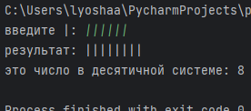
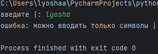

# finals2 

# 2.9  

## Задание
A={ | }   
Считая слово P записью числа в единичной системе счисления, увеличить это число на 2.   

## Проделанная работа

Реализовал нормальный алгоритм Маркова в виде класса на языке python. В адгоритме только одно правило: приписать к строке две палочки || и завершить выполнение. Пользователь вводит число в виде |, и программа увеличивает его на 2.

## Скриншоты

  

  

## Список использованных источников

[Задачник по машинам Тьюринга и алгоритмам Маркова](https://cmcmsu.info/download/cmc.mt.markov.tasks.2016.pdf)
